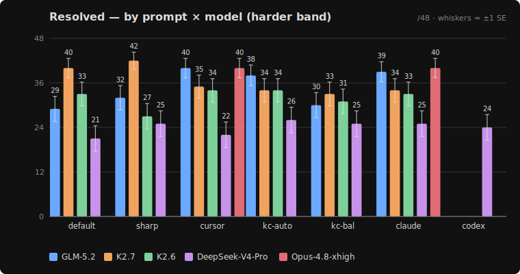
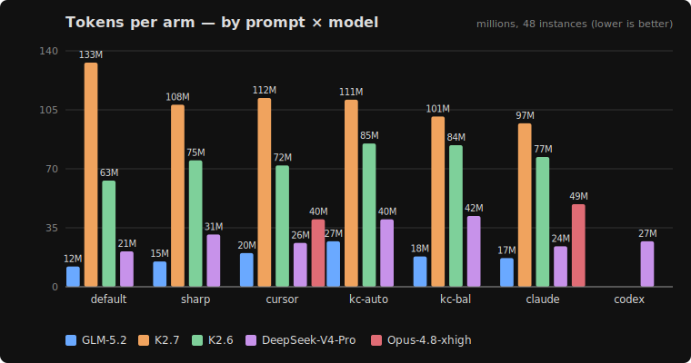
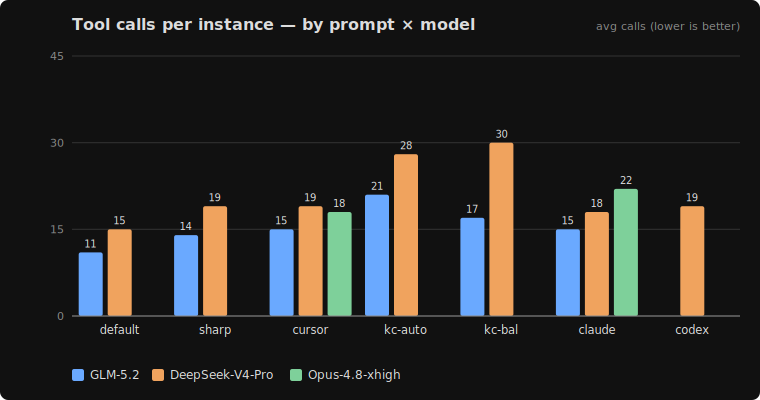

# kimi-tools

A small benchmark that answers one practical question: **does the agent system
prompt change how much a coding model can solve — and is the best prompt the same
across models?** Short answer: the prompt matters, **the best prompt is
model-specific** (not ordered by model strength) — but mostly because it changes
*whether the model commits an edit at all*, not how well it reasons. Read
[What this measures](#what-this-measures-and-what-it-doesnt) before over-reading the table.

It runs real coding-agent system prompts (Claude Code, Cursor, `sharp`, and our two
Kimi-tuned `kimi-cline` prompts) through the **opencode** harness against
[**SWE-bench Verified**](https://huggingface.co/datasets/princeton-nlp/SWE-bench_Verified)
— real GitHub issues scored by the official `swebench.harness.run_evaluation`
(hidden FAIL_TO_PASS / PASS_TO_PASS tests). Models: **GLM-5.2**, **DeepSeek-V4-Pro**,
and **Kimi K2.6 / K2.7** via Fireworks, plus a **Claude Opus 4.8** cross-family probe.

> **Note — Fireworks + Kimi thinking mode.** `kimi-k2p7-code` (K2.7) is a reasoning
> model; `kimi-k2p6` (K2.6) is not. On Fireworks, **run K2.7 with thinking left
> ON** — in an endpoint micro-benchmark, *disabling* reasoning on the `-code` model
> blew time-to-first-token up to **~26 s** (vs **~0.5 s** with it on) and the model
> emitted reasoning tokens anyway, so turning it off bought nothing and cost a lot.
> K2.6 is unaffected. Every run here uses K2.7 in its native thinking mode.

## Headline — system-prompt bake-off (harder band)

**48 instances across 8 repos** (sympy, scikit-learn, sphinx, xarray, matplotlib,
astropy, pytest, django — the "15 min–1 h" and "1–4 h" difficulty bands), swapping
only the agent system prompt. `default` = opencode's built-in coding prompt; the
other five are (adapted) [system prompts](system-prompts/). Resolved out of the
full **48** (every instance grades on the Linux eval host).

| prompt | GLM-5.2 | K2.7 | K2.6 | DeepSeek-V4-Pro | Opus-4.8 (xhigh) |
|--------|:-------:|:----:|:----:|:---------------:|:----------------:|
| **default** (opencode) | 29/48 | **40/48** | 33/48 | 21/48 | — |
| sharp | 32/48 | **42/48 (88%)** | 27/48 | 25/48 | — |
| cursor | **40/48** | 35/48 | 34/48 | 22/48 | **40/48** |
| kimi-cline (autonomous) | 38/48 | 34/48 | 34/48 | **26/48** | — |
| kimi-cline (balanced) | 30/48 | 33/48 | 31/48 | 25/48 | — |
| claude-code | 39/48 | 34/48 | 33/48 | 25/48 | **40/48** |
| codex | — | — | — | 24/48 | — |
| **best arm** | cursor 40 | **sharp 42** | cursor/kcauto 34 | kcauto 26 | cursor/claude 40 |

<sub>**K2.7's `sharp` (42/48) is the single best arm in the whole bake-off.**
**Opus-4.8 (xhigh)** is a cross-family probe — only its `cursor` and `claude-code` arms
were run (`—` = not run); details and cost in [Opus 4.8 below](#opus-48--a-cross-family-probe).
`codex` was run on DeepSeek only.</sub>

> **Why `/48` now (was `/43`).** An earlier version reported `/43`, excluding 5
> matplotlib instances whose prebuilt eval images wouldn't unpack on a **macOS/colima**
> grading box. On the Linux eval host all 48 grade cleanly, so every number here is the
> honest full-band grade.
>
> **The Kimi numbers also changed for a second reason:** the original harder-band Kimi
> run was **degraded** (truncated trajectories — most likely the K2.7 thinking-mode /
> time-to-first-token failure described in the note above), which had K2.7 at 13–25 and
> K2.6 at 14–21. A clean re-run on the *same* harness as the other models puts K2.7 at
> **33–42** and K2.6 at **27–34**. Treat the re-run as authoritative; the old Kimi
> numbers are retired.



**There is no universal best prompt, and the two strongest models want opposite
things.** Each model has a *different* best arm — and the direction flips:

1. **GLM-5.2 wants scaffolding badly** — `cursor` (**40/48**), `claude-code` (39),
   `kcauto` (38) tower over bare `default` (29), which is GLM-5.2's *worst* arm (+11).
2. **K2.7 wants the opposite — no scaffold.** Bare `default` (40) and `sharp` (42) are
   its best; every heavier coding-agent prompt *hurts*, down to `kcbal` (33). The least
   instruction wins. K2.7's `sharp` (**42/48**) is the top arm in the entire bake-off.
3. **K2.6 is flatter and milder** — `cursor`/`kcauto` (34) lead, `sharp` (27) trails,
   but the whole swing is ~7 and it has no strong directional preference.
4. **DeepSeek-V4-Pro is flat and ceiling-limited** — every arm sits in a narrow
   **21–26/48** band (best `kcauto` 26, worst `default` 21). The prompt barely moves it.

So the best prompt is **not** ordered by model strength: the two top models (K2.7,
GLM-5.2) sit at opposite ends of the scaffold axis, and the closed frontier model
(Opus) is indifferent to it.

**The mechanism is the empty-patch rate.** Under bare `default`, GLM-5.2 ends
**12/48** trajectories without committing any source edit; the coding-agent scaffolds
("edit the source, don't stop at analysis"; verify before finishing) cut that to
**1–4**, and the resolved-rate gain tracks the empty-rate drop almost exactly. **K2.7
already drives a decisive edit loop on `default`** (1–6 empty everywhere), so the same
scaffolds add only friction — which is why they *cost* it instances. **DeepSeek also
barely bails** (2–4 empty/48 on every prompt), so the scaffold has no attempt-rate to
buy — it commits confidently and is simply *wrong* more often. Decisiveness ≠
capability. On this band **K2.7 is the strongest model** (sharp 42/48), edging GLM-5.2
at its best (cursor 40/48) — but at **5–10× the token cost** (see below).

### Cost — by prompt × model





**Capability and cost are inversely ranked here.** GLM-5.2 is the **cheapest
everywhere** — ~12–27 M tokens/arm and the fewest tool calls — for a top-tier result.
**K2.7 buys its chart-topping 42/48 with brute force:** 97–133 M tokens/arm (a
reasoning model, thinking on) and 43–50 tool calls/instance — **5–10× GLM's tokens**
for a ~2-instance edge. K2.6 is in between (63–85 M). **DeepSeek-V4-Pro is no bargain
despite its lean tool count**: 21–42 M tokens/arm (≈2× GLM) for the *lowest* resolve.
So the value ranking is GLM ≫ everything: same ceiling as K2.7/Opus at a fraction of
the cost. Charts are rendered by [`ab/make_cost_charts.py`](ab/make_cost_charts.py)
(pure-stdlib SVG, no matplotlib) from [`ab/bake-off-cost.csv`](ab/bake-off-cost.csv).

### Opus 4.8 — a cross-family probe

Does a frontier *closed* model clear this band? Two probes — **Claude Opus 4.8 at
`xhigh` reasoning effort** (Anthropic, via opencode `--variant xhigh`), on the
`claude-code` and `cursor` prompts:

| arm | resolved /48 | empty | cost |
|-----|:---:|:---:|:---:|
| opus-4.8-xhigh · claude-code | **40/48 (83%)** | 1 | $52.46 |
| opus-4.8-xhigh · cursor | **40/48 (83%)** | 3 | $43.71 |

It lands **level with GLM-5.2's strong arms and K2.7's default/sharp (40/48), not above
them** — a frontier closed model at high effort ≈ well-scaffolded GLM-5.2 or
no-scaffold K2.7 here, at ~**$96 for the pair** vs GLM's Fireworks pennies. And Opus's
prompt sensitivity is **flat** (claude = cursor = 40) — a "no scaffold needed" profile,
like DeepSeek's, not GLM-5.2's big swing.

⚠️ **Significance.** Two large, robust prompt effects, in *opposite* directions:
**GLM-5.2's scaffold gain (default 29 → cursor 40, ≈ +11)** and **K2.7's scaffold
*penalty* (sharp 42 → kcbal 33, ≈ −9)**. DeepSeek's whole swing (~5/48), K2.6's (~7),
and Opus's (0) are small by comparison — trust "GLM needs a scaffold / K2.7 is hurt by
one / the rest don't move much," not the exact 1–2 instance orderings. Full numbers,
cost profiles, the empty-patch analysis, and a patch-extraction leak we found & fixed:
**[`ab/FINDINGS-swe.md`](ab/FINDINGS-swe.md)**.

> **The easy band is retired as a headline.** An earlier version of this README led
> with 8 `psf/requests` instances and a dramatic "family split" (`sharp` 2/8 vs
> `claude-code` 8/8). That spread was a **grading artifact** — the suite hammers a
> live `httpbin` service that flaked during sequential runs; a deterministic re-grade
> collapses it to 6–7/8 for every arm. The easy band can't separate the prompts and is
> kept only as a near-ceiling control. See [FINDINGS → Easy band, re-graded](ab/FINDINGS-swe.md).

## What this measures (and what it doesn't)

Don't read the table as "prompt P makes the model a better coder." Decomposing each score
into *attempt rate* (did it commit an edit?) and *conditional quality* (was the edit correct,
given it tried) shows the prompt mostly buys the **first**:

- **~60% of GLM-5.2's biggest gain (`default`→`cursor`, +11) is just follow-through** — the
  attempt rate going 75%→92%. Only ~40% is better patches. GLM bails without editing **12/48**
  times on bare `default`; the scaffold's job is to stop it bailing.
- **The effect is ceiling-limited.** Opus-4.8 barely bails (94–98% attempt) so the prompt has
  nothing to move — both its arms tie. K2.7 already finishes, so scaffolds only add noise and
  *hurt* it. The size of any prompt effect is set by how much a model abandons the edit loop on
  its default, not by how much "better" the prompt makes it.
- **Contamination — we tested it.** SWE-bench Verified is public and pre-cutoff; these models
  were almost certainly trained on these repos. So we re-ran GLM-5.2 and K2.7 on **30 fresh,
  post-cutoff problems** (SWE-rebench `2026_03`, issues created 2026-03→05). Result:
  **capability generalizes** (GLM's `default` is 60% on both bands) — it is *not* pure
  memorization — but **GLM's big pro-scaffold effect does not** (`cursor` − `default` collapses
  from **+23 pp** to **+3 pp**), while **K2.7's anti-scaffold penalty does** (−10 pp → −20 pp).
  On un-memorizable problems, *less* scaffolding wins for both models. The headline pro-scaffold
  signal is substantially benchmark-overfit; raw capability is real. Full write-up:
  **[FINDINGS → post-cutoff validity test](ab/FINDINGS-validity.md)**.

## Repo layout

| Path | What |
|------|------|
| [`ab/FINDINGS-swe.md`](ab/FINDINGS-swe.md) | The SWE-bench results above, in full (4 models × 6 prompts + DeepSeek codex + the Opus probe). |
| [`ab/FINDINGS-validity.md`](ab/FINDINGS-validity.md) | **Post-cutoff validity test** — GLM-5.2 & K2.7 on 30 fresh 2026 problems; what generalizes vs what was benchmark-overfit. |
| [`ab/`](ab/) | The benchmark harnesses + `swe_bench.py` (predict/eval/aggregate) + all `FINDINGS-*.md`. |
| [`ab/README-swe.md`](ab/README-swe.md) | How to run the SWE-bench predict + eval pipeline. |
| [`ab/bake-off-cost.csv`](ab/bake-off-cost.csv) | Harder-band data (resolved/48, tokens, tools); [`make_cost_charts.py`](ab/make_cost_charts.py) renders it to `ab/charts/bakeoff-*.svg`. |
| [`system-prompts/`](system-prompts/) | Every prompt the bake-off runs — `claude-code/`, `cursor/`, `sharp.md`, plus our own `kimi-cline/`. Each external one keeps the raw extract and an `.oc-adapted.md` opencode port. |
| [`system-prompts/kimi-cline/`](system-prompts/kimi-cline/) | **Our two Kimi-tuned cline prompts** (balanced + autonomous) — see [its README](system-prompts/kimi-cline/README.md). |

## Quick start

```bash
# SWE-bench predict (opencode + a Fireworks model):
python3 ab/swe_bench.py predict --model glm5.2 --repos psf/requests --out preds.jsonl

# Opus 4.8 at a reasoning-effort variant (needs ANTHROPIC_API_KEY in env):
python3 ab/swe_bench.py predict --model opus4.8-xhigh --instances astropy__astropy-12907 \
    --agent-prompt system-prompts/claude-code/2.1.178/interactive-cli.oc-adapted.md --out preds.jsonl

# Regenerate the cost charts from the CSV:
python3 ab/make_cost_charts.py
```

See [`ab/README-swe.md`](ab/README-swe.md) for the colima/Docker eval setup.
