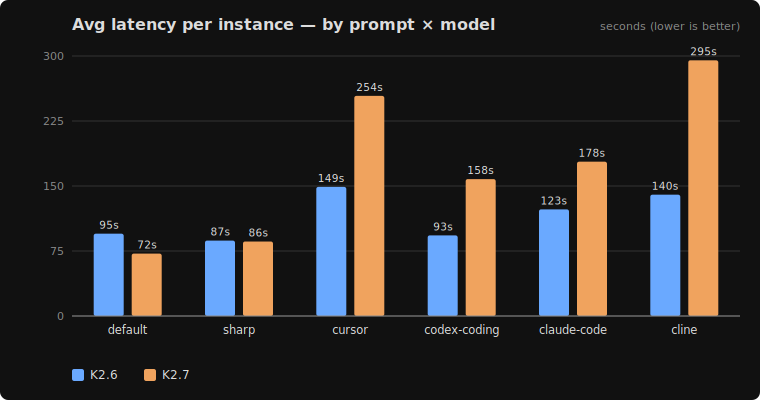
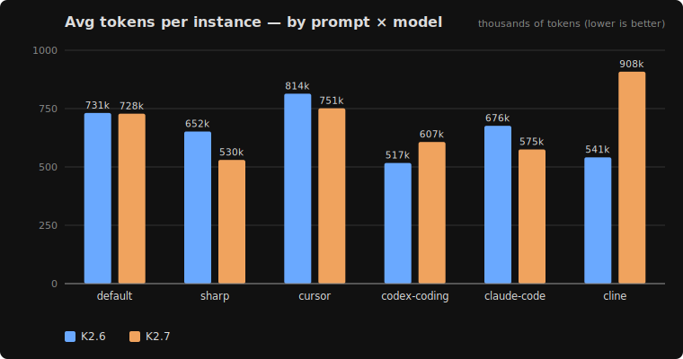
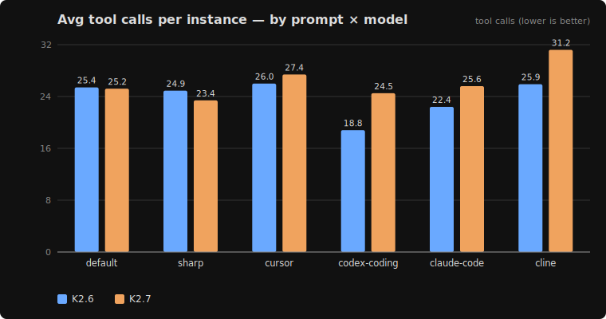

# kimi-tools

A small benchmark that answers one practical question: **for Kimi K2 coding
agents, does the system prompt actually change task success — and which prompt
is best?**

It runs real coding-agent system prompts (Claude Code, Codex, Cursor, Cline, and
two Kimi-tuned ones) through the **opencode** harness against
[**SWE-bench Verified**](https://huggingface.co/datasets/princeton-nlp/SWE-bench_Verified)
real GitHub issues, scored by the official
`swebench.harness.run_evaluation` (hidden FAIL_TO_PASS / PASS_TO_PASS tests).
Models: **Kimi K2.6** and **K2.7** via Fireworks.

> **Note — Fireworks + Kimi thinking mode.** `kimi-k2p7-code` (K2.7) is a
> reasoning model; `kimi-k2p6` (K2.6) is not. On Fireworks, **run K2.7 with
> thinking left ON** — in an endpoint micro-benchmark, *disabling* reasoning on
> the `-code` model blew up time-to-first-token to **~26 s** (vs **~0.5 s** with
> it on) and the model emitted reasoning tokens anyway, so turning it off bought
> nothing and cost a lot. K2.6 is unaffected — ~0.4 s TTFT and ~106 tok/s either
> way. Every run here uses K2.7 in its native thinking mode.

## Headline result — system-prompt bake-off

6 prompts × 2 models, same 8 `psf/requests` instances, swapping only the agent
system prompt. `default` = opencode's built-in coding prompt; the other five use
(modified) [system prompts](system-prompts/).

| prompt | K2.6 | K2.7 | source |
|--------|------|------|--------|
| **default** (opencode) | 6/8 | 6/8 | opencode built-in |
| sharp | 2/8 | 4/8 | Kimi tool-hygiene-tuned |
| cursor | 3/8 | 4/8 | Cursor Composer (leak) |
| codex-coding | 7/8 | 6/8 | OpenAI Codex `base_instructions` |
| **claude-code** | 7/8 | **8/8** | Claude Code interactive CLI |
| cline (native-next-gen) | 7/8 | 7/8 | Cline default |

Cells = **resolved instances out of 8** (1 attempt each). Per-arm **cost** —
latency, tokens, tool calls — is in the [charts below](#cost-at-a-glance) and the
sortable table.

📊 **[Sortable version](https://htmlpreview.github.io/?https://github.com/fl4p/kimi-tools/blob/main/ab/bake-off.html)**
— the full 12-row per-model table ([`ab/bake-off.html`](ab/bake-off.html)) with
click-to-sort columns. (GitHub READMEs can't run JS, so the sortable view is a
standalone page.)

**Per-model averages** (across all 6 prompts, per-instance):

| model | avg latency | avg tokens | avg tools |
|-------|-------------|------------|-----------|
| K2.6  | 115s | 655k | 23.9 |
| K2.7  | 174s | 683k | 26.2 |

Across the whole prompt set K2.7 averaged slower and did slightly more work — the
reverse of the `default`-only slice (where K2.7 was faster) — yet the two models
**tie on what they resolve**. Latency is noisy, so read this as "comparable work,
no capability gap," not a clean speed ranking.

### Cost at a glance







Blue = K2.6, orange = K2.7. `cursor`/`cline` on K2.7 are the expensive outliers;
`codex-coding` is cheapest-and-correct (fewest tool calls *and* tokens at the
best resolved rate). Charts are rendered by
[`ab/make_cost_charts.py`](ab/make_cost_charts.py) (pure-stdlib SVG) from
[`ab/bake-off-cost.csv`](ab/bake-off-cost.csv) — the benchmark's own output
(`swe_bench.py aggregate`), not hand-entered numbers.

**Two clean families:**

1. **Harness-/terseness-tuned prompts regress** (`sharp`, `cursor`) — they were
   tuned for tool-hygiene metrics or a different UI, and on real tasks they trade
   correctness for concision.
2. **Real general coding-agent prompts match or beat the default**
   (`codex-coding`, `claude-code`, `cline`) — all land at 7–8/8. They were built
   to drive a read→edit→verify loop on real repos, so they transfer even after
   tool-name adaptation.

**Takeaways:** `claude-code` on K2.7 is the only arm to hit **8/8**, helped by its
"edit the source, don't stop at analysis" discipline. `codex-coding` is the
**efficiency winner** (best/tied resolved at the fewest tokens + tool calls). And
across every run, **K2.6 ≈ K2.7 on what they can solve** — they differ only in
latency/cost/failure-shape, not capability, at this difficulty band.

→ Full tables, cost profiles, the sharp-prompt regression, and caveats:
**[`ab/FINDINGS-swe.md`](ab/FINDINGS-swe.md)**.

## Repo layout

| Path | What |
|------|------|
| [`ab/`](ab/) | The benchmark harnesses (cline, opencode, pi) + `swe_bench.py` predict/eval + all `FINDINGS-*.md`. |
| [`ab/FINDINGS-swe.md`](ab/FINDINGS-swe.md) | The SWE-bench results above, in full. |
| [`ab/README.md`](ab/README.md) | How to run the A/B harness. |
| [`ab/README-swe.md`](ab/README-swe.md) | How to run the SWE-bench predict + eval pipeline. |
| [`ab/bake-off-cost.csv`](ab/bake-off-cost.csv) | Cost-profile data (`swe_bench.py aggregate` output); [`make_cost_charts.py`](ab/make_cost_charts.py) renders it to `ab/charts/*.svg`. |
| [`system-prompts/`](system-prompts/) | Every prompt the bake-off runs — `claude-code/`, `codex/`, `cursor/`, `cline/`, `kimi/`, `sharp.md`, plus our own `kimi-cline/`. Each external one keeps the raw extract and an `.oc-adapted.md` opencode port. |
| [`system-prompts/kimi-cline/`](system-prompts/kimi-cline/) | **Our two Kimi-tuned cline prompts** (balanced + autonomous) — see [its README](system-prompts/kimi-cline/README.md). |

## Quick start

```bash
# A/B harness, no API needed — prove the pipeline works:
cd ab && python3 ab_bench.py --self-test && python3 ab_bench.py --dry-run

# SWE-bench predict (opencode + Kimi via Fireworks):
python3 ab/swe_bench.py predict --model k2.7 --repos psf/requests --out preds.jsonl
```

See [`ab/README-swe.md`](ab/README-swe.md) for the colima/Docker eval setup.
