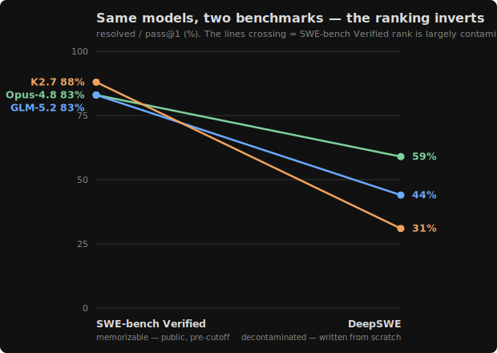

# SWE-bench Verified: GLM-5.2 / Kimi K2.7 / K2.6 / DeepSeek-V4-Pro — system-prompt bake-off

Scored by the **official** `swebench.harness.run_evaluation` — real GitHub issues
with hidden FAIL_TO_PASS / PASS_TO_PASS grading tests. We run opencode (via Fireworks)
on each issue, extract the `git diff`, and grade it. The question: does swapping the
agent **system prompt** change how much a model can solve, and does the answer differ
across models — **GLM-5.2, Kimi K2.7, Kimi K2.6, and DeepSeek-V4-Pro** (+ a Claude Opus
4.8 cross-family probe)?

We tested two difficulty bands:
- **harder band** — 48 instances across 8 repos (sympy / scikit-learn / sphinx /
  xarray / matplotlib / astropy / pytest / django), the "15 min–1 h" and "1–4 h"
  bands. This is the signal-bearing run.
- **easy band** — all 8 `psf/requests` instances ("<15 min–1 h", pure-Python). Near
  the ceiling for every arm; useful mainly as a control.

Six prompts: `default` (opencode's built-in coding agent), `claude-code`, `cursor`,
`sharp` (a tool-hygiene-tuned prompt), and our two `kimi-cline` prompts (balanced +
autonomous); DeepSeek additionally ran a `codex` arm. All four models ran the harder
band × all six prompts.

> **Denominator note (`/48`, was `/43`).** An earlier version reported `/43`, excluding
> 5 matplotlib instances whose prebuilt eval images wouldn't unpack on a macOS/colima
> grading box. On the Linux eval host all 48 grade cleanly, so everything here is the
> full-band grade. **The Kimi numbers also changed for a second reason:** the original
> Kimi harder-band run was *degraded* (truncated trajectories — most likely the K2.7
> thinking-mode / time-to-first-token failure noted below), scoring K2.7 13–25 and K2.6
> 14–21. A clean re-run on the same harness puts K2.7 at **33–42** and K2.6 at **27–34**.
> The re-run is authoritative.

## TL;DR

1. **The best prompt is model-specific — and the two strongest models want opposite
   things.** **GLM-5.2 → cursor** (40/48), **K2.7 → sharp/default** (42/40), **K2.6 →
   cursor/kcauto** (34), **DeepSeek → kcauto** (26). The same scaffolds that *lift* GLM
   (+11) *hurt* K2.7 (−9).
2. **The top is a ~40 tie, not a K2.7 win.** K2.7 `sharp` (42), K2.7 `default` (40), GLM-5.2
   `cursor` (40) and Opus (40/40) sit within ~1 SE (±3–4 at n=48) — the 42-vs-40 gap is ~2
   instances. And the order is **contamination-driven**: on the decontaminated, written-from-
   scratch [DeepSWE](https://deepswe.datacurve.ai/) benchmark K2.7 ranks **last** of the three
   (31% vs GLM 44%, Opus 59%), and it drops on our own fresh `/30`. So K2.7's nominal lead here
   is *familiarity*, not durable capability. **GLM-5.2 is the value pick** (top-tier at its best,
   fewest tokens — K2.7 pays ~2× the tokens, ~65k vs ~30k/instance).
3. **DeepSeek-V4-Pro is the weakest and flat** (21–26/48). It *attempts* as readily as
   anyone (2–4 empty/48) but its **conditional quality is ~50%** — it commits confidently
   and is wrong half the time. Decisiveness ≠ capability.
4. **The mechanism is the empty-patch rate.** GLM bails 12/48 on bare `default`; scaffolds
   cut that to 1–4 and the resolved rate climbs with it. K2.7/Opus already finish, so
   scaffolds only jiggle quality (down for K2.7).
5. **A frontier *closed* model doesn't clear the bar.** Opus-4.8 at `xhigh` resolves
   **40/48** on both its arms — level with GLM-5.2's and K2.7's best, not above — at
   ~$44–52/arm vs Fireworks pennies.
6. **We tested contamination.** A post-cutoff re-run (30 fresh 2026 problems) shows
   capability **generalizes**, but GLM's pro-scaffold effect is **largely benchmark-
   overfit** (collapses +23pp→+3pp) while K2.7's anti-scaffold effect generalizes. See
   **[FINDINGS-validity.md](FINDINGS-validity.md)**.

## Headline — harder band (8 repos, 48 instances)

Same opencode harness, swapping only the `--agent-prompt`. Run on an x86-64 Linux server
with native Docker; all 48 instances grade. Resolved out of **48**:

| prompt | GLM-5.2 | K2.7 | K2.6 | DeepSeek-V4-Pro |
|--------|:-------:|:----:|:----:|:---------------:|
| default | 29 (60%) | **40 (83%)** | 33 (69%) | 21 (44%) |
| sharp   | 32 (67%) | **42 (88%)** | 27 (56%) | 25 (52%) |
| cursor  | **40 (83%)** | 35 (73%) | 34 (71%) | 22 (46%) |
| kimi-cline (autonomous) | 38 (79%) | 34 (71%) | 34 (71%) | **26 (54%)** |
| kimi-cline (balanced)   | 30 (63%) | 33 (69%) | 31 (65%) | 25 (52%) |
| claude-code | 39 (81%) | 34 (71%) | 33 (69%) | 25 (52%) |
| codex | — | — | — | 24 (50%) |
| **best / worst arm** | **cursor 40 / default 29** | **sharp 42 / kcbal 33** | cursor/kcauto 34 / sharp 27 | kcauto 26 / default 21 |

**There is no universal best prompt, and it is not ordered by model strength.** Each
model has a *different* best arm, and the direction of the scaffold effect flips:

1. **GLM-5.2 wants scaffolding badly** — `cursor` (40, 83%), `claude-code` (39), `kcauto`
   (38) tower over bare `default` (29), GLM's *worst* arm. A +11 swing.
2. **K2.7 wants the opposite — no scaffold.** Bare `default` (40) and `sharp` (42) win;
   every heavier coding-agent prompt *hurts*, down to `kcbal` (33). K2.7's `sharp` (42) is the
   nominal top arm, but only ~2 instances over the GLM/Opus 40-cluster (within noise).
3. **K2.6 is flatter and milder** — `cursor`/`kcauto` (34) lead, `sharp` (27) trails; ~7
   spread, no strong direction.
4. **DeepSeek-V4-Pro is flat and ceiling-limited** — 21–26/48 across every arm (best
   `kcauto` 26). The prompt barely moves it.

So the prompt effect is **model-specific**, set by each model's default-prompt failure
mode, not its raw strength: the two top models (K2.7, GLM-5.2) sit at opposite ends of the
scaffold axis, and the closed frontier model (Opus) is indifferent to it.

**The mechanism is the empty-patch rate.** Under bare `default`, GLM-5.2 ends **12/48**
trajectories without committing any source edit; the coding-agent scaffolds ("edit the
source, don't stop at analysis"; verify before finishing) cut that to **1–4**, and the
resolved-rate gain tracks the empty-rate drop almost exactly. K2.7 already drives a
decisive edit loop on `default` (1–6 empty everywhere), so the same scaffolds only add
friction — which is why they *cost* it instances. At their best, **K2.7, GLM-5.2 and Opus
tie at ~40/48** (K2.7 sharp 42 is ~2 instances up, within noise) — but K2.7 pays ~2× the
tokens, and its lead doesn't survive decontamination (DeepSWE ranks it last; see *Contamination*).

### Harder-band cost (median tokens/instance · median tool calls/instance)

| prompt | GLM-5.2 | K2.7 | K2.6 | DeepSeek |
|--------|---|---|---|---|
| default | 28k / 11 | 80k / 50 | 45k / 33 | 31k / 15 |
| sharp   | 32k / 14 | 56k / 43 | 50k / 41 | 34k / 19 |
| cursor  | 30k / 15 | 69k / 44 | 51k / 36 | 36k / 19 |
| kimi-cline (autonomous) | 31k / 21 | 62k / 43 | 46k / 41 | 37k / 28 |
| kimi-cline (balanced)   | 30k / 17 | 67k / 44 | 47k / 41 | 42k / 30 |
| claude-code | 29k / 15 | 59k / 43 | 49k / 39 | 35k / 18 |

<sub>`tok` = median tokens/instance (opencode's final cumulative session total — **not** the
sum of per-step counters, which is a ~(steps/2)× overcount we fixed); `tools` = median tool
calls/instance. On Fireworks all three open models bill only ~$1/arm, so cost separation is
in tokens, not dollars. **Capability and cost are inversely ranked: GLM-5.2 is cheapest *and*
top-tier (~30k/inst); K2.7 buys its 42/48 with ~2× the tokens (~65k/inst); DeepSeek is no
bargain** (~GLM's tokens for the lowest resolve). GLM's heavy in-solve installing
exposed (and we fixed) a patch-extraction leak — see **GLM-5.2 notes** below.</sub>

## Compliance vs capability: the attempt-rate decomposition

A resolved instance needs two things: the model must **attempt** an edit (non-empty patch)
*and* the edit must be **correct**. Splitting each score into *attempt rate* (1 − empty/48)
and *conditional quality* (resolved | attempted) separates "does it act" from "does it act
well" — and cleanly explains the ranking:

| model | prompt | resolved/48 | empty | attempt % | correct \| attempted |
|---|---|:--:|:--:|:--:|:--:|
| GLM-5.2 | default | 29 | 12 | 75% | 81% |
| GLM-5.2 | cursor | **40** | 4 | 92% | **91%** |
| GLM-5.2 | kcauto | 38 | 1 | **98%** | 81% |
| K2.7 | default | 40 | 2 | 96% | 87% |
| K2.7 | sharp | **42** | 2 | 96% | **91%** |
| K2.7 | claude | 34 | 1 | 98% | 72% |
| K2.6 | default | 33 | 5 | 90% | 77% |
| K2.6 | cursor | 34 | 2 | 96% | 74% |
| DeepSeek | kcauto | **26** | 2 | 96% | **57%** |
| DeepSeek | default | 21 | 3 | 94% | 47% |
| Opus-4.8-xhigh | cursor | 40 | 3 | 94% | 89% |
| Opus-4.8-xhigh | claude | 40 | 1 | 98% | 85% |

- **~60% of GLM-5.2's headline gain is just follow-through.** Its best swing `default`→
  `cursor` (+11): holding conditional quality at default's 81% and lifting only the attempt
  rate 75%→92% predicts ~36 resolved (**+6.5**); the actual 40 means the remaining **+4.5**
  is better patches (81%→91%). Roughly **60% compliance, 40% quality**.
- **DeepSeek is the cautionary tale.** It attempts as much as anyone (92–96%) but its
  conditional quality is **~50%** — half its committed patches are wrong. High follow-
  through with low correctness ⇒ confident but wrong. The scaffold can't fix that.
- **The effect is ceiling-limited by the empty rate.** Opus barely bails (1–3 empty,
  94–98% attempt) → no attempt-rate headroom → both arms tie at 40. K2.7 already finishes,
  so scaffolds can only jiggle quality, often downward (claude drops it to 72%). **The size
  of any prompt effect is set by how much the model bails on its default**: GLM bails a lot
  → large effect; everyone else already finishes → small effect.

The high absolute conditional-correct rates (47–91% on a public, pre-cutoff benchmark) raise
the contamination question head-on — which we test directly below.

## Contamination — the post-cutoff validity test

Because the high conditional-correct rates are consistent with partly *recalling* memorized
fixes, we re-ran GLM-5.2 and K2.7 on **30 fresh problems created 2026-03→05** (SWE-rebench
`2026_03`, after the models' training cutoff), arms `default` / `cursor` / `bare`:

| arm | GLM pre `/48` | GLM post `/30` | K2.7 pre `/48` | K2.7 post `/30` |
|-----|:---:|:---:|:---:|:---:|
| default | 29 (60%) | 18 (60%) | 40 (83%) | 22 (73%) |
| cursor | 40 (83%) | 19 (63%) | 35 (73%) | 16 (53%) |
| bare | — | 21 (70%) | — | 19 (63%) |
| scaffold gap | **+23pp** | **+3pp** | **−10pp** | **−20pp** |

**Capability generalizes** (GLM `default` 60% on both bands — not pure memorization), but
**GLM's pro-scaffold effect does not** (the bake-off's biggest effect, +23pp, collapses to
+3pp; `bare` is GLM's best fresh arm) while **K2.7's anti-scaffold penalty does** (−10→−20pp).
On un-memorizable problems, *less* scaffolding wins for both. The headline pro-scaffold signal
is substantially benchmark-overfit; raw capability is real. Full write-up + caveats:
**[FINDINGS-validity.md](FINDINGS-validity.md)**.

**An independent benchmark agrees — and it reorders the models.** [DeepSWE](https://deepswe.datacurve.ai/)
(113 tasks *written from scratch*, never adapted from real commits/PRs, so unmemorizable by
construction; all models on the same minimal `mini-swe-agent`) ranks the three we share:
**Opus-4.8 59% · GLM-5.2 44% · K2.7 31% (last)**. That is the *opposite* of our top-of-board
order, where K2.7 nominally leads. The model that tops *this* (memorizable) benchmark is the
one that falls furthest on novel tasks — the textbook contamination signature. So our ~40 tie
should be read as "K2.7/GLM/Opus all reach ~40 *on problems they may have seen*," not as a
durable capability ranking; out-of-sample, **Opus > GLM > K2.7**.



## Opus 4.8 (xhigh) — a cross-family probe

Does a frontier *closed* model clear this band? Two cross-family probes — **Claude Opus 4.8
at `xhigh` reasoning effort** (Anthropic, via opencode `run --variant xhigh`) on the
`claude-code` and `cursor` prompts, same 48-instance band, same harness:

| arm | resolved /48 | empty | cost/arm | tokens/inst |
|-----|:---:|:---:|:---:|:---:|
| opus-4.8-xhigh · claude-code | **40/48 (83%)** | 1 | ~$6 | ~39k |
| opus-4.8-xhigh · cursor      | **40/48 (83%)** | 3 | ~$6 | ~39k |

**Both land level with GLM-5.2's and K2.7's best (40/48), not above.** A frontier closed
model at high reasoning effort ≈ a well-scaffolded open model on this band — at
**~$6/arm (~$12 for the pair)**, a few × the Fireworks models' ~$1/arm but not the order
of magnitude an uncorrected count would suggest. (Anthropic billing is cache-aware: most of
Opus's tokens are cache-reads at $0.5/M, so ~$0.13/instance.) **Opus's prompt sensitivity is flat**
(claude = cursor = 40), and `cursor` actually *raised* its empty rate (3 vs 1) — a "wants no
scaffold" profile like K2.7's and DeepSeek's, not GLM-5.2's big swing.

<sub>Two of six prompts, not the bare `default` baseline — a partial read. Anthropic via
opencode is **API-key only** (no Claude Pro/Max OAuth in this build); reasoning effort is
per-run with `opencode run --variant high|xhigh|max`.</sub>

## GLM-5.2 notes (empty-patch mechanism + a harness leak)

**The empty-patch mechanism, per arm.** GLM-5.2's prompt sensitivity is almost entirely
about *whether it commits an edit at all*. Empty-patch counts by arm (out of 48): default
12, kcbal 9, sharp 5, claude 4, cursor 4, **kcauto 1**. The arms that suppress empties
resolve more, near-monotonically. When GLM commits, it is accurate — on `default`, 29 of its
36 non-empty patches resolve (81%); `cursor` reaches 40/48. Per-repo it is excellent on
`pydata/xarray`, `astropy` and `sympy`, weaker on `django`.

**A latent harness leak this run exposed (and we fixed twice).** GLM pip-installs and runs
tests in-solve far more than Kimi, which surfaced a patch-extraction bug:

- The harness sets `PYTHONUSERBASE`/`PIP_CACHE_DIR` *inside* the throwaway workdir (host
  hygiene), so `extract_patch`'s `git add -A` swept the installed `site-packages` (254 MB)
  and pip cache into the patch — 25 MB diffs. First fix: exclude `.pyuserbase`/`.pipcache`.
- But scaffolded arms revealed agents also create their *own* scratch — cursor built a
  `.venv311` (3672 files) + `_pylibs` (49 MB diff), sharp made `repro_docs`/`testproj`.
  Blacklisting names is hopeless. **General fix:** `extract_patch` now drops any newly-created
  top-level path that did not exist in the repo at `base_commit` (allowlist from `git ls-tree
  HEAD`), keeping real edits and new source files under existing package dirs.

The Kimi/DeepSeek runs read+edited rather than installing, so they never triggered the leak.
All figures above are on allowlist-cleaned patches; the fix is in `swe_bench.py`.

## Easy band (8 `psf/requests`), re-graded clean — and a retraction

An earlier version of this doc made the easy band the spine and reported a sharp
"two-families" split: hygiene/UI-tuned prompts (`sharp` 2/8, `cursor` 3/8) supposedly
*regressing* far below `default`, with `claude-code` perfect at 8/8 on K2.7. **That split
does not survive clean grading. We retract it.**

**Why it was wrong.** The `psf/requests` suite makes real `httpbin` calls in *both*
FAIL_TO_PASS and PASS_TO_PASS tests. Arms are graded sequentially, and `httpbin.org` flaked
during the run (503s, `JSONDecodeError`, timeouts), so an arm's score partly recorded
*httpbin's uptime during its slot*, not the model's fix.

**The fix: deterministic re-grade** against a **local** httpbin (`kennethreitz/httpbin` on an
`--internal` Docker network aliased to `httpbin.org`), so every arm grades under identical,
offline conditions:

| prompt | strict K2.6 | **fix-correct K2.6** | strict K2.7 | **fix-correct K2.7** |
|---|:---:|:---:|:---:|:---:|
| default | 1/8 | **6/8** | 2/8 | **6/8** |
| claude-code | 2/8 | **7/8** | 2/8 | **7/8** |
| cursor  | 2/8 | **7/8** | 2/8 | **7/8** |
| sharp   | 2/8 | **7/8** | 2/8 | **7/8** |
| kimi-cline (balanced)   | 2/8 | **7/8** | 2/8 | **7/8** |
| kimi-cline (autonomous) | 2/8 | **7/8** | 2/8 | **6/8** |

**Fix-correctness is uniform 6–7/8 — no family split, no standout.** Strict resolved is an
environmental floor (~2/8) pinned by PASS_TO_PASS tests that need HTTPS/SSL/real timeouts no
local httpbin can serve (e.g. `test_mixed_case_scheme_acceptable` fails in all 48 arm-runs).
Every arm loses the same instances, so strict resolved here measures the network environment,
not the model. The only honest easy-band statement is **"near-ceiling for all arms, no
separation"** — it's a control, not a discriminator, and the harder band drives the entire result.

## What's real vs what's noise

- **The big, robust effects are two, in opposite directions:** GLM-5.2's scaffold *gain*
  (default 29 → cursor 40, ≈+11, several SE, driven by the 12→1–4 empty-patch collapse) and
  K2.7's scaffold *penalty* (sharp 42 → kcbal 33, ≈−9). DeepSeek's whole swing (~5/48), K2.6's
  (~7), and Opus's (0) are small by comparison.
- **Within-model fine orderings are within ~1 SE** at n=48 (≈±3–4 on a 50–85% rate) — trust
  "GLM needs a scaffold / K2.7 is hurt by one / DeepSeek & Opus barely move," not the exact
  1–2 instance arm orderings.
- **The pro-scaffold effect is partly benchmark-overfit** — the post-cutoff test shows GLM's
  +23pp collapses to +3pp on fresh problems. The anti-scaffold effect (K2.7) generalizes.
- **DeepSeek's low conditional quality (~50%) is the most separable model-level fact** — it's
  not noise; it attempts plenty and is simply wrong half the time.

**Bottom line:** trust the *direction* (scaffolds help GLM, hurt K2.7, don't move DeepSeek/
Opus; capability generalizes but the pro-scaffold magnitude is overfit) and the cost ordering
(GLM cheapest in tokens, K2.7 ~2× pricier); don't over-read 1–2 instance arm gaps.

## Pipeline
- **Predict**: `swe_bench.py` — clone repo@base_commit, run opencode on the issue, extract
  `git diff` (excluding test files + `opencode.json`) as the model_patch via an allowlist from
  `git ls-tree HEAD`. Custom prompts seed an opencode agent via `--agent-prompt`. `--retries`
  guards the Fireworks-hang class (hung call → timeout → empty patch). `--dataset-jsonl` runs
  any local instance set (used for the post-cutoff SWE-rebench validity run).
- **Eval**: official swebench, native Docker on the Linux host. `eval_runner.py` runs arms
  **sequentially** (the flake guard) and drives the deterministic local-httpbin re-grade.
  Post-cutoff grading uses the [SWE-rebench swebench fork](https://github.com/SWE-rebench/SWE-bench-fork)
  with `--namespace swerebench` against the project's prebuilt Docker images.

## Caveats (why this isn't the final word)
- **n=48, 1 attempt/instance (no pass@k).** Within-model arm-to-arm gaps sit inside one SE;
  the GLM scaffold-vs-default and K2.7 default-vs-scaffold gaps clear it.
- **The Kimi re-run replaced a degraded original** (see denominator note). If anything the new
  numbers are the *floor* — the old run's truncation only ever lost instances.
- **Contamination — now tested, not just flagged.** SWE-bench Verified is public/pre-cutoff;
  the post-cutoff validity run ([FINDINGS-validity.md](FINDINGS-validity.md)) shows capability
  generalizes but the pro-scaffold magnitude is overfit. N=30 there; a larger fresh sample and
  pass@k would tighten it.

## Repro
```bash
# 1) predict (SWE-bench Verified band; --dataset-jsonl <file> for a custom/fresh set)
python3 swe_bench.py predict --model k2.7 --repos psf/requests \
    --agent-prompt system-prompts/claude-code/...interactive-cli.oc-adapted.md \
    --out preds_k27.jsonl

# 2) eval (native Docker on Linux host)
python3 ab/eval_runner.py --report-dir eval --arm claude_k27 preds_k27.jsonl

# 2b) post-cutoff grade via the SWE-rebench fork (prebuilt swerebench images)
python -m swebench.harness.run_evaluation --dataset_name nebius/SWE-rebench-leaderboard \
    --split 2026_03 --predictions_path preds.jsonl --namespace swerebench --cache_level instance

# 3) render charts
python3 make_cost_charts.py          # bake-off-cost.csv -> charts/bakeoff-*.svg
```

The committed `bake-off-cost.csv` + `charts/*.svg` are the snapshot (raw `preds_*` / eval
reports are gitignored).
